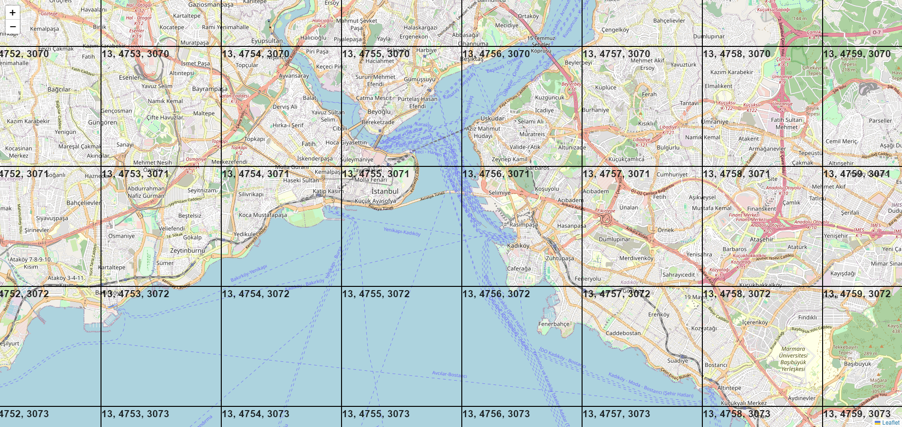

# Map Tiles View

Live: [https://duoquote.github.io/map-tiles-view/](https://duoquote.github.io/map-tiles-view/)

## What is this?

This is a simple web app that allows you to view map tiles' X, Y and Z indexes. It's useful when you're working with map tiles and need to know the indexes of a specific tile.

Screenshot:

